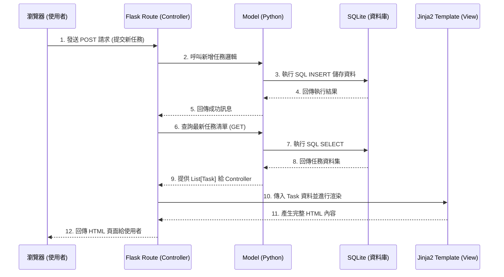

# 系統架構設計 (Architecture) - 任務管理系統

根據 PRD 的需求，這份文件定義了任務管理系統的技術架構、資料夾結構以及各個系統元件之間的關係。

## 1. 技術架構說明

本專案採用輕量且能快速開發的網頁應用程式架構，不採用前後端分離，直接在後端伺服器進行模板渲染。

### 選用技術與原因
- **後端框架：Python + Flask**
  - 原因：Flask 是一個輕量級的微框架，適合用於開發中小型或 MVP 階段的專案。它的學習曲線平緩，且能快速建立起提供動態網頁內容的伺服器。
- **模板引擎：Jinja2**
  - 原因：作為 Flask 預設支援的模板引擎，Jinja2 能將後端傳遞過來的資料（如任務清單、完成狀態）動態渲染到 HTML 頁面中，不需要另外建置龐大的前端框架（如 React / Vue）。
- **資料庫：SQLite**
  - 原因：SQLite 是一個輕量級的本機關聯式資料庫，不需要額外設定資料庫伺服器，非常適合單一使用者的任務管理系統以及快速原型開發。

### Flask MVC 模式說明
本專案採用經典的 MVC (Model-View-Controller) 架構模式設計：
- **Model (模型)**：負責定義資料結構與資料庫互動邏輯。將會撰寫 Python 程式碼向 SQLite 資料庫進行 CRUD（新增、讀取、更新、刪除）操作，如 `Task` 模型。
- **View (視圖)**：負責將資料呈現給使用者看。對應到 `templates` 資料夾內的 Jinja2 HTML 檔案。
- **Controller (控制器)**：負責處理來自瀏覽器的 HTTP 請求，向 Model 索取資料後，將取得的資料傳遞給 View 進行渲染。在 Flask 中，這一層對應到 `routes` 的各個路由函式。

---

## 2. 專案資料夾結構

為了保持專案的可維護性，會將不同職責的程式碼分散到不同資料夾中。

```text
web_app_development/
├── app/
│   ├── __init__.py           # Flask 應用程式工廠，用於初始化 app 與資料庫設定
│   ├── models.py             # Model 層：定義 Task 資料模型與資料庫互動
│   ├── routes.py             # Controller 層：定義各個 URL 路由與業務邏輯
│   ├── templates/            # View 層：存放 Jinja2 HTML 樣板檔案
│   │   ├── base.html         # 各頁面共用的基礎 HTML 骨架（含 Navbar, 載入 CSS 等）
│   │   └── index.html        # 任務清單主頁面（繼承 base.html，包含新增、列表與篩選介面）
│   └── static/               # 存放靜態資源
│       ├── css/
│       │   └── style.css     # 全域樣式表
│       └── js/
│           └── script.js     # 若需要加上基礎的前端互動（如非同步刪除、狀態切換）可放這裡
├── instance/
│   └── database.db           # SQLite 實體資料庫檔案（由系統自動產生）
├── docs/                     # 專案相關文件
│   ├── PRD.md                # 產品需求文件
│   └── ARCHITECTURE.md       # 系統架構設計文件 (本文件)
├── app.py                    # 系統進入點，負責啟動 Flask 伺服器
├── requirements.txt          # Python 依賴套件清單 (如 Flask, SQLAlchemy)
└── README.md                 # 專案說明文件
```

---

## 3. 元件關係圖

以下使用 Mermaid 語法展示系統元件之間的互動流程：



---

## 4. 關鍵設計決策

1. **依賴 SQLAlchemy 作為 ORM 還是純 SQL？**
   - **決策**：為了提高開發速度並降低後續的維護難度，建議使用 `Flask-SQLAlchemy` 作為 ORM 工具。雖然需求簡單，寫原生 SQL 也能做到，但使用 ORM 能讓程式碼更有 Pythonic 風格，避免過多繁瑣的字串拼接。
2. **單頁應用 (SPA) 還是傳統多頁網頁 (MPA)？**
   - **決策**：採用傳統的 SSR（Server-Side Rendering）搭配簡單的表單 POST。由於任務管理系統屬於個人自用的 MVP 產品，使用 Jinja2 渲染 HTML 可以大幅降低初期複雜度。如果有需要，後續可在頁面上局部加上 JavaScript 以優化切換狀態與刪除時的互動體驗。
3. **任務狀態篩選的實作方式**
   - **決策**：不採用前端的 JavaScript 隱藏 DOM 的方式進行篩選。會直接實作於後端路由中。例如 URL 加入 Query Parameter (`/?filter=completed` 或 `/?filter=pending`)，由 Flask Controller 讀取參數後，向資料庫查詢對應條件的任務再渲染給頁面。
4. **狀態變更方式（未完成/已完成切換）**
   - **決策**：提供一鍵切換狀態的捷徑，無需進入編輯頁面。這可透過專屬的 POST route（如 `/task/<int:id>/toggle`）來實現，讓操作體驗更快速直覺。
