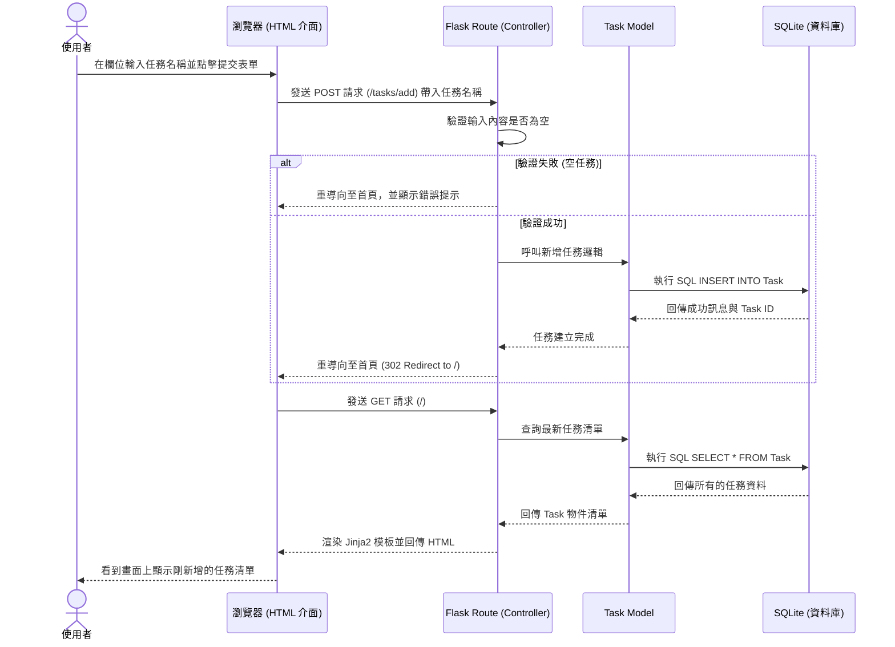

# 流程圖設計 (Flowchart) - 任務管理系統

根據 PRD 與系統架構文件，本文件規劃了使用者的操作流程圖、系統資料處理的序列圖，以及功能對應列表。

## 1. 使用者流程圖 (User Flow)

描述使用者進入系統後，可以進行的各項操作路徑。

```mermaid
flowchart LR
    Start([使用者開啟網頁]) --> Home[首頁 - 任務清單總覽]
    
    Home --> Action{要執行什麼操作？}
    
    %% 新增任務流程
    Action -->|新增任務| InputForm[在輸入框輸入任務名稱]
    InputForm --> SubmitBtn[點擊「新增」按鈕]
    SubmitBtn --> |系統處理中| ReloadHome1[重新載入並顯示新任務]
    ReloadHome1 --> Home
    
    %% 狀態篩選流程
    Action -->|切換視角| Filter[點擊狀態篩選 (全部/未完成/已完成)]
    Filter --> |載入特定任務| ReloadHome2[重新載入過濾後的清單]
    ReloadHome2 --> Home
    
    %% 狀態切換流程
    Action -->|更新狀態| ToggleStatus[點擊任務旁的狀態切換開關]
    ToggleStatus --> |標記為已完成/未完成| ReloadHome3[狀態更新並重新載入]
    ReloadHome3 --> Home
    
    %% 刪除任務流程
    Action -->|刪除任務| DeleteBtn[點擊「刪除」按鈕]
    DeleteBtn --> |移除資料| ReloadHome4[任務消失並重新載入]
    ReloadHome4 --> Home
```

## 2. 系統序列圖 (Sequence Diagram)

描述「使用者新增任務」時，資料如何在系統各元件間流動。



## 3. 功能清單對照表

以下整理了系統主要功能、其對應的 URL 路徑，以及前端發送的 HTTP 方法：

| 功能名稱 | URL 路徑 | HTTP 方法 | 說明 |
| --- | --- | --- | --- |
| 顯示清單與篩選 | `/` | GET | 顯示任務清單。可透過 Query Parameter（如 `/?filter=completed`）顯示過濾後的任務 |
| 新增任務 | `/tasks/add` | POST | 接收表單內容並新增任務，成功後重新導向至 `/` |
| 切換完成狀態 | `/tasks/<int:task_id>/toggle` | POST | 切換該任務的完成狀態（未完成變已完成，反之亦然），完成後重新導向至 `/` |
| 刪除任務 | `/tasks/<int:task_id>/delete` | POST | 刪除特定任務，成功後重新導向至 `/` |

> **說明**：由於初期架構採傳統網頁應用（SSR）、HTML 表單提交，為確保資料安全與遵循 HTTP 標準，狀態切換與刪除等會改變資料狀態的操作，皆使用 `POST` 方法發送至伺服器處理。
